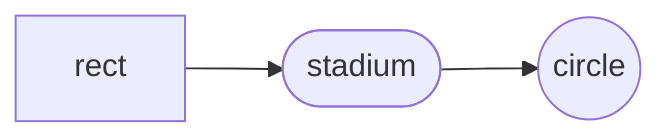
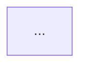
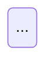

# Napkin

Generate a mermaid diagram from the current conversation and file it into today's DIAGRAMS rollup. The user invokes this inline, e.g. "create a /napkin explaining the before/after" — you draw the diagram, describe it briefly, and write it to the right spot in today's file.

## Target file

Always `~/development/workdiary/DIAGRAMS/YYYY-MM-DD.md` where `YYYY-MM-DD` is today's local date.

Get today's date with:
```
date +%Y-%m-%d
```

## Workflow

1. Resolve today's date and target path.
2. Check if the target file exists (`test -f <path>`).
3. Decide the diagram's **title** and **project** (see Inference below).
4. Produce the mermaid diagram (see Diagram guidance).
5. Write a **1–3 sentence** description (see Description guidance).
6. File the diagram into the target according to the **Insertion logic**.
7. Confirm to the user: one line with the file path, project (or "no project"), and title.
8. **Optional render step** (see Optional rendering below) — only when the user explicitly asks, e.g. "and check the render", "render it so I can see", "preview this".

## Inference

**Title** — infer from the conversation. Keep it short and descriptive (e.g. "IDVR abort behavior: before vs. after"). Do not ask — pick one.

**Project** — infer from conversation context (file paths, tickets, tags the user has used earlier, explicit mentions). Canonicalize the display form to how the user writes it in their workdiary (e.g. `IDVR`, `Identity Verification`, `POP-2216`).

Ask exactly one short question **only if** project is genuinely ambiguous — for example:
> Quick check — file this under `IDVR`, `Identity Verification`, or no project?

If the user explicitly says "no project" or the topic is cross-cutting (e.g. "mermaid reference"), skip the project and put the diagram in the no-project zone.

## Diagram guidance

- Use mermaid, fenced as ` ```mermaid ... ``` `.
- Pick the diagram type that fits the intent: `flowchart TD` for process/decision, `sequenceDiagram` for call flows, `stateDiagram-v2` for state machines, `erDiagram` for schemas.
- Label nodes with real identifiers from the conversation (`file:line`, endpoint names, service names) when they exist — the user prefers grounded diagrams.
- Prefer one focused diagram over a sprawling one. If the user asked for before/after, two small diagrams side by side (separate mermaid blocks under the same `###`) is fine.

## Mermaid syntax pitfalls

Mermaid's parser is brittle and many special characters silently break a diagram that looks fine in plain text. Always produce valid syntax on the first try — the user sees a parse error before they see your diagram.

- **Semicolons (`;`) terminate statements in sequenceDiagram.** A note like `Note over A,B: one thing; another thing` is parsed as two statements, and the second one almost always fails. **Never put `;` inside note text, participant labels, or titles.** Use `.`, `,`, or an em-dash (`—`) instead. This is the most common cause of "Parse error" when the diagram looks fine in plain text.
- **`#` starts a comment in some contexts.** Prefix hashes inside labels with care; prefer writing out the word or quoting the full label.
- **Parentheses in `flowchart` node labels** can confuse the shape parser (e.g. `A[foo (bar)]`). If the label contains `(`, `)`, `[`, `]`, `{`, `}`, or a colon, wrap the label in double quotes: `A["foo (bar)"]`.
- **Newlines in notes/labels must be `<br/>`, not literal newlines.** `\n` does not work.
- **`end` is a reserved word.** Don't use it as a node id in flowcharts that also have `subgraph ... end` blocks — the parser gets confused.
- **Colons after keywords need a space.** Write `Note over A,B: text`, not `Note over A,B:text`.
- **Avoid unicode arrows (`→`, `←`) in mermaid syntax positions** (edge definitions, participant arrows). They're fine *inside* quoted labels and notes, just not as structural tokens.
- **Notes inside `rect` blocks in sequenceDiagram must span the full participant width the rect covers.** A `rect` computes its height from the vertical extent of the messages between its participants, not from narrow notes at the edge. If the rect participants span A→DB but you write `Note over A,B:` inside it, the note can render *below* the rect's colored background. Fix: widen the note to match the widest participant range in the rect (`Note over A,DB:`), or place the note immediately before an arrow that spans the full width so the rect's bounding box picks it up.
- **Informative subgraph titles are good — but pick orientation to fit them.** Long titles like `Entry points (parents of the modal)` or `Events to Avo and Rudderstack` help readers skim. In `flowchart TD`, wide-but-shallow subgraphs force the title into a thin horizontal strip, and Obsidian's mermaid renderer (stricter than `mmdc`) wraps the title into the subgraph body where it overlaps child nodes. The fix is **orientation, not truncation**: when any subgraph title is longer than ~20 characters, default to `flowchart LR`. LR gives each subgraph a tall-and-narrow frame with plenty of vertical room for the title and renders cleanly in Obsidian and mmdc alike.
- **Use `/` sparingly in subgraph titles.** Mermaid's renderer treats `/` as a soft-wrap hint. `Events to Avo / Rudderstack` will wrap at the slash in Obsidian even when other long titles wouldn't. Use "and" or a comma instead, or switch to LR orientation where the extra width absorbs the slash.
- **When to prefer `flowchart TD` over `LR`:** branching trees (one root, many children) or decision flows with short node labels. **When to prefer `LR`:** pipelines and funnels (A → B → C → D stages), diagrams with 4+ subgraphs, or any diagram where subgraph titles carry meaningful context.
- **Self-loops in `flowchart LR` route across the entire canvas.** A line like `Pending -- "..." --> Pending` (same node on both sides) does not draw a tight loop beside the node — mermaid's LR layout engine sends the edge all the way out to the right margin and back, often crossing every other node in the diagram and making the output look broken. This is especially bad in lifecycle diagrams where "stays in state X" feels natural to draw. **Don't draw it.** If the "stays here until condition Y" idea matters, encode it in the node's body text (`IDVR not yet COMPLETED`) or in the prose above the diagram. If you genuinely need a visible self-loop, `stateDiagram-v2` renders them compactly — but weigh that against the colon/br pitfall below.
- **`stateDiagram-v2` transition labels choke on `:`, `<br/>`, and `(` / `)`.** A transition line like `A --> B: IDVR completes<br/>(action_service.py:120)` fails with `Expecting ... got 'DESCR'` because mermaid reserves `:` as the state-description delimiter — the colon inside `.py:120` and inside the parenthesized citation both get reparsed as new state descriptors. Unlike `flowchart`, there is **no quoting escape hatch** for stateDiagram transition labels: you cannot wrap the label in double quotes to opt out. Symptoms: parse error pointing at a trailing `)` or at a colon that looks fine in isolation. Fix options, in order of preference: (1) switch the diagram to `flowchart LR` with quoted node labels — `flowchart` accepts `<br/>`, `:`, `(`, `#` freely inside `"..."` — this is the right call whenever transitions need citations like `file.py:123`; (2) keep stateDiagram but strip transition labels to bare words (`A --> B: completes`) and push detail into the prose above the diagram; (3) use `#58;` HTML entity for `:` and drop `<br/>` entirely. Rule of thumb: if your diagram concept is a lifecycle *and* you want `file.py:line` citations on transitions, start with `flowchart LR` — stateDiagram-v2 will fight you.

If a diagram you wrote produces a "Parse error," the fix is almost always one of the above. Scan the cited line for a stray `;`, `#`, `:`, or unquoted `(`/`[` before rewriting anything structural. If a diagram renders but **looks wrong** (text overlapping nodes, labels behind edges), the cause is usually a wrapped subgraph title or a mis-scoped `rect` note — above.

## Description guidance

- 1–3 sentences, immediately under the `### {title}` heading, **before** the mermaid fence.
- Add context the diagram cannot convey: *why* this comparison exists, what trigger motivated it, what question it is answering. Never narrate what the diagram already shows.
- If there is nothing useful to say beyond the title, skip the description.

## Optional rendering

Trigger **only** when the user explicitly asks. The user reads these diagrams in Obsidian, so a local render is a sanity check, not a perfect preview — Obsidian's mermaid renderer is stricter than `mmdc` about subgraph title wrapping and some edge routing. If the render looks clean in `mmdc`, Obsidian usually (but not always) agrees.

### One-time setup

First invocation will need chrome-headless-shell installed for puppeteer. If the render step fails with "Could not find Chrome," tell the user to run:

```
npx -y puppeteer browsers install chrome-headless-shell
```

### Per-diagram render

Chrome versions drift — resolve the binary path at render time rather than hardcoding it.

1. Find the currently installed chrome-headless-shell:

```
CHROME_PATH=$(ls ~/.cache/puppeteer/chrome-headless-shell/*/chrome-headless-shell-*/chrome-headless-shell 2>/dev/null | head -1)
```

If `$CHROME_PATH` is empty, the user hasn't run the install step — ask them to run it and stop.

2. Regenerate `~/.claude/napkin/puppeteer-config.json` with the resolved path (cheap, keeps the config fresh as puppeteer updates):

```
mkdir -p ~/.claude/napkin
printf '{"executablePath": "%s"}\n' "$CHROME_PATH" > ~/.claude/napkin/puppeteer-config.json
```

3. Write the mermaid body (just the fenced content, no `---` or prose) to `/tmp/napkin-<slug>.mmd` where `<slug>` is a short kebab-case derivation of the diagram title.
4. Render:

```
npx -y -p @mermaid-js/mermaid-cli mmdc \
  -i /tmp/napkin-<slug>.mmd \
  -o /tmp/napkin-<slug>.png \
  -b transparent -t dark --scale 2 \
  --puppeteerConfigFile ~/.claude/napkin/puppeteer-config.json
```

5. After a successful render, `Read` the PNG so it appears inline in the reply. The user can visually confirm the diagram before opening Obsidian.

### What a render can catch

- Node/edge overlap from too-dense layouts.
- Mis-scoped `rect` blocks in sequence diagrams.
- Accidentally orphaned nodes (typos in edge definitions leave a node floating).
- Aspect ratio problems that make the diagram unusable at the Obsidian column width.

### What a render will miss

- **Obsidian-specific title wrapping.** mmdc gives subgraph titles more horizontal budget than Obsidian does, so a title that renders fine here may still wrap there. Trust the "informative titles + LR orientation" rule above — don't assume a clean mmdc render means Obsidian will agree.
- Obsidian-specific CSS overrides (the user's theme may adjust node padding, font size, line height).

### Cost

~15–30 seconds per render after first run (puppeteer launch + chrome startup). ~2 minutes on first run (package download). Skip unless explicitly requested.

## File creation (when target doesn't exist)

Write a new file with this exact shape (two blank lines after frontmatter is intentional so the first `###` is not glued to the `---`):

```
---
created: YYYY-MM-DD
tags: []
---

```

Then proceed to insertion as if the file exists.

## Insertion logic

The file has two zones:

- **No-project zone**: everything after the closing `---` of the frontmatter and before the first `## ` (H2) heading.
- **Project zones**: each `## {project}` heading and the content up to the next `## ` or end-of-file.

**If the diagram has no project:**

1. Read the target file.
2. Find the insertion anchor: the line immediately before the first `## ` heading. If the file has no `## ` heading, the anchor is end-of-file.
3. Append the new `### {title}` block at that anchor. Preserve one blank line before and after the new block.
4. Do not touch any existing text.

**If the diagram has a project:**

1. Read the target file.
2. Case-insensitive search for an existing `## {project}` heading. If multiple hand-written variants exist (unlikely), match the first and preserve its casing.
3. **If found**: append the new `### {title}` block as the last child of that project section — the anchor is "the line immediately before the next `## ` heading, or end-of-file if this is the last project."
4. **If not found**: append a new `## {project}` section to the end of the file. Use the project casing as the user writes it.
5. Preserve one blank line before and after the new block.

**Tool mechanics**: use `Edit` with a `new_string` that contains the unique surrounding-context lines (e.g. the frontmatter closer `---\n\n`, or the last two lines of a project section) as the anchor in `old_string`. If the file is new and empty-after-frontmatter, use `Write` for the initial scaffold then `Edit` for the diagram block. Never regex-rewrite the whole file.

## Title collision

If a `### {title}` already exists in the same bucket (same project zone, or both in the no-project zone), uniquify by appending ` (2)`, ` (3)`, etc. — find the next unused suffix. Do not touch the existing heading.

## Frontmatter tag update

If the diagram has a project, merge the project tag into the frontmatter `tags:` list:

1. Transform the project to a tag: lowercase, spaces → hyphens (`Identity Verification` → `identity-verification`, `POP-2216` → `pop-2216`).
2. Read the existing `tags: [...]` line.
3. If the tag is already present (case-insensitive), do nothing.
4. Otherwise insert it at the end of the list.
5. Use `Edit` to replace the old `tags:` line with the updated one.

Never touch the `created:` line once the file exists.

## Block format

The full block you write under a `###` heading:

```
### {title}

{description — 1–3 sentences, or omit this line entirely if nothing to say}

```mermaid
{diagram body}
```
```

Exactly one blank line between the heading, the description, and the fence.

## Output to the user

After filing, reply with one short line:

> Filed → `DIAGRAMS/2026-04-23.md` → `IDVR` → `Abort behavior: before vs. after`

Also show the mermaid in the chat reply itself so the user can see what you drew without opening the file.

## Examples of the heading layout

```
---
created: 2026-04-23
tags: [idvr, identity-verification]
---

### Mermaid shape cheatsheet

Quick reference of node shapes I keep forgetting.



## IDVR

### Abort behavior: before vs. after

Why the existing path aborts only PENDING/IN_PROGRESS and what the split endpoint changes.



### Solo provider intake flow


## Identity Verification

### Action lifecycle


```

## What not to do

- Do not create dated subfolders (`DIAGRAMS/2026/04/23.md`) — flat files only, matching the workdiary convention.
- Do not migrate or touch the existing topic-based files in `DIAGRAMS/` (e.g. `idvr-solo-provider-intake.md`). They are long-form docs and coexist with the daily rollups.
- Do not ask for a title. Infer it.
- Do not write descriptions longer than 3 sentences.
- Do not change `created:` on an existing file.
