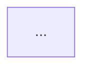

# Napkin

Generate a mermaid diagram from the current conversation and file it into today's DIAGRAMS rollup. The user invokes this inline, e.g. "create a /napkin explaining the before/after" — you draw the diagram, describe it briefly, and write it to the right spot in today's file.

## Target file

Always `~/development/workdiary/DIAGRAMS/YYYY-MM-DD.md` where `YYYY-MM-DD` is today's local date.

Get today's date with:
```
date +%Y-%m-%d
```

## Workflow

1. Resolve today's date and target path.
2. Check if the target file exists (`test -f <path>`).
3. Decide the diagram's **title** and **project** (see Inference below).
4. Produce the mermaid diagram (see Diagram guidance).
5. Write a **1–3 sentence** description (see Description guidance).
6. File the diagram into the target according to the **Insertion logic**.
7. Confirm to the user: one line with the file path, project (or "no project"), and title.

## Inference

**Title** — infer from the conversation. Keep it short and descriptive (e.g. "SYNC abort behavior: before vs. after"). Do not ask — pick one.

**Project** — infer from conversation context (file paths, tickets, tags the user has used earlier, explicit mentions). Canonicalize the display form to how the user writes it in their workdiary (e.g. `SYNC`, `Data Migration`, `PROJ-1234`).

Ask exactly one short question **only if** project is genuinely ambiguous — for example:
> Quick check — file this under `SYNC`, `Data Migration`, or no project?

If the user explicitly says "no project" or the topic is cross-cutting (e.g. "mermaid reference"), skip the project and put the diagram in the no-project zone.

## Diagram guidance

- Use mermaid, fenced as ` ```mermaid ... ``` `.
- Pick the diagram type that fits the intent: `flowchart TD` for process/decision, `sequenceDiagram` for call flows, `stateDiagram-v2` for state machines, `erDiagram` for schemas.
- Label nodes with real identifiers from the conversation (`file:line`, endpoint names, service names) when they exist — the user prefers grounded diagrams.
- Prefer one focused diagram over a sprawling one. If the user asked for before/after, two small diagrams side by side (separate mermaid blocks under the same `###`) is fine.

## Description guidance

- 1–3 sentences, immediately under the `### {title}` heading, **before** the mermaid fence.
- Add context the diagram cannot convey: *why* this comparison exists, what trigger motivated it, what question it is answering. Never narrate what the diagram already shows.
- If there is nothing useful to say beyond the title, skip the description.

## File creation (when target doesn't exist)

Write a new file with this exact shape (two blank lines after frontmatter is intentional so the first `###` is not glued to the `---`):

```
---
created: YYYY-MM-DD
tags: []
---

```

Then proceed to insertion as if the file exists.

## Insertion logic

The file has two zones:

- **No-project zone**: everything after the closing `---` of the frontmatter and before the first `## ` (H2) heading.
- **Project zones**: each `## {project}` heading and the content up to the next `## ` or end-of-file.

**If the diagram has no project:**

1. Read the target file.
2. Find the insertion anchor: the line immediately before the first `## ` heading. If the file has no `## ` heading, the anchor is end-of-file.
3. Append the new `### {title}` block at that anchor. Preserve one blank line before and after the new block.
4. Do not touch any existing text.

**If the diagram has a project:**

1. Read the target file.
2. Case-insensitive search for an existing `## {project}` heading. If multiple hand-written variants exist (unlikely), match the first and preserve its casing.
3. **If found**: append the new `### {title}` block as the last child of that project section — the anchor is "the line immediately before the next `## ` heading, or end-of-file if this is the last project."
4. **If not found**: append a new `## {project}` section to the end of the file. Use the project casing as the user writes it.
5. Preserve one blank line before and after the new block.

**Tool mechanics**: use `Edit` with a `new_string` that contains the unique surrounding-context lines (e.g. the frontmatter closer `---\n\n`, or the last two lines of a project section) as the anchor in `old_string`. If the file is new and empty-after-frontmatter, use `Write` for the initial scaffold then `Edit` for the diagram block. Never regex-rewrite the whole file.

## Title collision

If a `### {title}` already exists in the same bucket (same project zone, or both in the no-project zone), uniquify by appending ` (2)`, ` (3)`, etc. — find the next unused suffix. Do not touch the existing heading.

## Frontmatter tag update

If the diagram has a project, merge the project tag into the frontmatter `tags:` list:

1. Transform the project to a tag: lowercase, spaces → hyphens (`Data Migration` → `data-migration`, `PROJ-1234` → `proj-1234`).
2. Read the existing `tags: [...]` line.
3. If the tag is already present (case-insensitive), do nothing.
4. Otherwise insert it at the end of the list.
5. Use `Edit` to replace the old `tags:` line with the updated one.

Never touch the `created:` line once the file exists.

## Block format

The full block you write under a `###` heading:

```
### {title}

{description — 1–3 sentences, or omit this line entirely if nothing to say}

```mermaid
{diagram body}
```
```

Exactly one blank line between the heading, the description, and the fence.

## Output to the user

After filing, reply with one short line:

> Filed → `DIAGRAMS/2026-04-23.md` → `SYNC` → `Abort behavior: before vs. after`

Also show the mermaid in the chat reply itself so the user can see what you drew without opening the file.

## Examples of the heading layout

```
---
created: 2026-04-23
tags: [sync, data-migration]
---

### Mermaid shape cheatsheet

Quick reference of node shapes I keep forgetting.


## SYNC

### Abort behavior: before vs. after

Why the existing path aborts only queued work and what the new endpoint changes.



### Batch retry flow


## Data Migration

### Action lifecycle


```

## What not to do

- Do not create dated subfolders (`DIAGRAMS/2026/04/23.md`) — flat files only, matching the workdiary convention.
- Do not migrate or touch the existing topic-based files in `DIAGRAMS/` (e.g. `sync-batch-retry.md`). They are long-form docs and coexist with the daily rollups.
- Do not ask for a title. Infer it.
- Do not write descriptions longer than 3 sentences.
- Do not change `created:` on an existing file.
